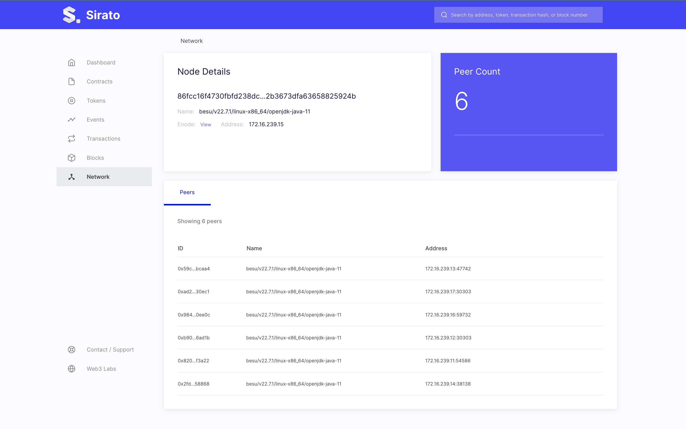
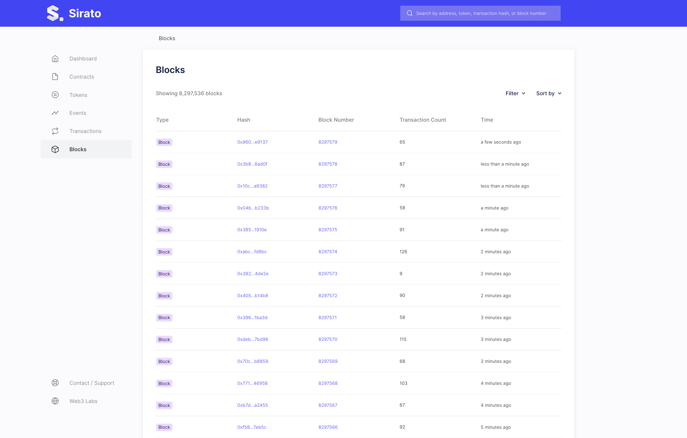
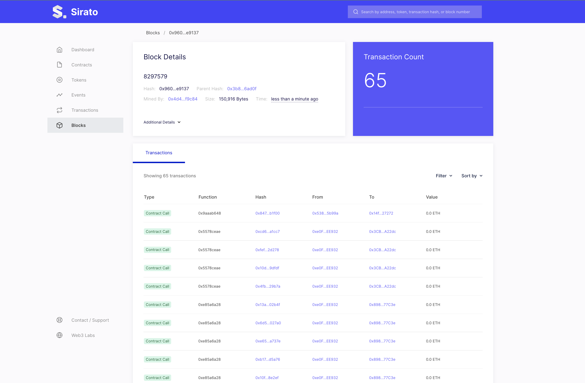
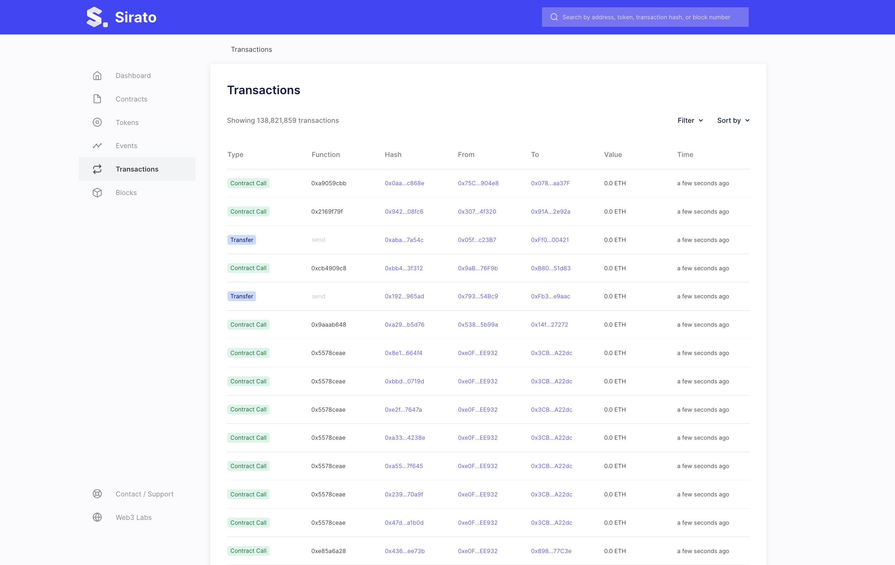

import Tabs from '@theme/Tabs';
import TabItem from '@theme/TabItem';

# Use Sirato Blockchain Explorer

[Sirato Blockchain Explorer](https://www.web3labs.com/sirato) supports public and private EVM networks. This page describes how to use the free version of Sirato with its built-in support for [privacy-enabled](../../concepts/privacy/index.md) Besu networks created using the [Developer Quickstart](../../tutorials/quickstart.md).

Sirato provides an overview of the entire network, including block information, contract metadata, transaction searches, and [more](https://medium.com/web3labs/epirus-ethereum-saas-blockchain-explorer-d5d961717d15).

:::note

You must connect to one of the privacy nodes (for example, `member1besu`), not the dedicated RPC, in order to allow access for Besu [privacy API methods](../../reference/api/index.md#priv-methods). In production networks, you must [secure access](../../../public-networks/how-to/use-besu-api/authenticate.md) to RPC nodes.

:::

## Prerequisites

[Docker and Docker Compose](https://docs.docker.com/compose/install/) installed.

## Start Sirato

Clone the [Sirato GitHub repository](https://github.com/web3labs/sirato-free):

```bash
git clone https://github.com/web3labs/sirato-free
```

The repository contains Docker Compose scripts to allow Sirato to start with a Developer Quickstart test network.

From the Sirato directory, run the following script:

<Tabs>

<TabItem value="Command" label="Command" default>

```bash
./start_sirato_besu.sh
```

</TabItem>

<TabItem value="Result" label="Result">

```bash
*************************************
Sirator Explorer for Besu
*************************************
Starting explorer
--------------------
[+] Running 5/5
  ⠿ Container docker-compose-mongodb-1    Started                                                                                                                    3.3s
  ⠿ Container docker-compose-api-1        Started                                                                                                                    4.1s
  ⠿ Container docker-compose-ingestion-1  Started                                                                                                                    4.2s
  ⠿ Container docker-compose-web-1        Started                                                                                                                    4.4s
  ⠿ Container docker-compose-nginx-1      Started                                                                                                                    5.0s
----------------------------------
Services
----------------------------------
Sirato explorer HTTP endpoint                 : http://localhost:260012
Sirato is connected to node                   : http://rpcnode:8545
```

</TabItem>

</Tabs>

Open `http://localhost/` on your browser. You’ll see the new initialization page while it boots up. This may take 5–10 minutes for the all services to start and the ingestion sync to complete.


## Use Sirato

The **Dashboard** page provides an aggregated view of network activities.


The **Network** page provides an overview of the network status and connected peers. This page is disabled by default, and is only visible if you set `DISPLAY_NETWOR_TAB=enabled` using the following command:

```bash
NODE_ENDPOINT=http://member1besu:8545 DISPLAY_NETWORK_TAB=enabled docker-compose -f docker-compose.yml -f sirato-extensions/docker-compose-quorum-dev-quickstart.yml up
```



The **Blocks** page shows a real-time view of the finalized blocks.



You can view a given block details by selecting a block hash or number.



The **Transactions** page shows a paginated view of new and historical transactions.



## Stop Sirato

To stop all the services from running, run the following script:

<Tabs>

<TabItem value="Command" label="Command" default>

```bash
./stop.sh
```

</TabItem>

<TabItem value="Result" label="Result">

```bash
*************************************
Sirator Explorer for Besu
*************************************
Stopping explorer
[+] Running 5/5
  ⠿ Container docker-compose-nginx-1      Stopped                                                                                                                    0.5s
  ⠿ Container docker-compose-ingestion-1  Stopped                                                                                                                    4.0s
  ⠿ Container docker-compose-web-1        Stopped                                                                                                                   10.3s
  ⠿ Container docker-compose-api-1        Stopped                                                                                                                    2.9s
  ⠿ Container docker-compose-mongodb-1    Stopped
```

</TabItem>

</Tabs>
