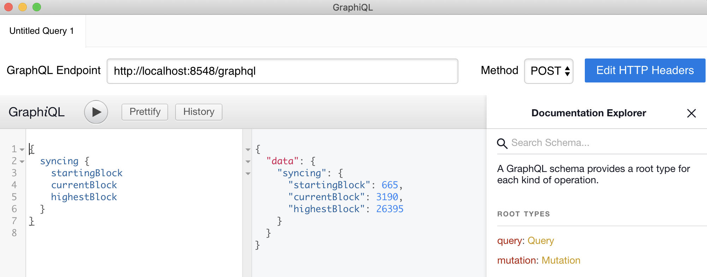

# Use GraphQL over HTTP

GraphQL can reduce the overhead needed for common queries. For example, instead of querying each receipt in a block, GraphQL can get the same result with a single query for the entire block.

The [Besu GraphQL schema] describes the GraphQL implementation for Ethereum. Enable the GraphQL service using [command line options](index.md#enable-api-access).

:::note

GraphQL is not supported over WebSocket.

:::

Access the GraphQL endpoint at `http://<HOST>:<PORT>/graphql`. Configure `<HOST>` and `<PORT>` using [`graphql-http-host`](../../reference/cli/options.md#graphql-http-host) and [`graphql-http-port`](../../reference/cli/options.md#graphql-http-port). The default endpoint is `http://127.0.0.1:8547/graphql`.

## GraphQL requests with cURL

[Hyperledger Besu JSON-RPC API methods](../../reference/api/index.md) with an equivalent [GraphQL](graphql.md) query include a GraphQL request and result in the method example.

The following [`syncing`](../../reference/api/index.md#eth_syncing) request returns data about the synchronization status.

```bash
curl -X POST -H "Content-Type: application/json" --data '{ "query": "{syncing{startingBlock currentBlock highestBlock}}"}' http://localhost:8547/graphql
```

## GraphQL requests with GraphiQL app

The third-party tool, [GraphiQL](https://github.com/skevy/graphiql-app), provides a tabbed interface for editing and testing GraphQL queries and mutations. GraphiQL also provides access to the [Besu GraphQL schema] from within the app.



## Pending

`transactionCount` and `transactions` supports the Pending query.

:::info

Besu does not execute pending transactions so results from `account`, `call`, and `estimateGas` for Pending do not reflect pending transactions.

:::

<!--tabs-->

# Pending transaction count

```bash
curl -X POST -H "Content-Type: application/json" --data '{ "query": "{pending {transactionCount}}"}' http://localhost:8547/graphql
```

# Result

```json
{
  "data": {
    "pending": {
      "transactionCount": 2
    }
  }
}
```

<!--/tabs-->

<!--tabs-->

# Pending transactions

```bash
curl -X POST -H "Content-Type: application/json" --data '{ "query": "{pending {transactions{hash}}}"}' http://localhost:8547/graphql
```

# Result

```json
{
  "data": {
    "pending": {
      "transactions": [
        {
          "hash": "0xbb3ab8e2113a4afdde9753782cb0680408c0d5b982572dda117a4c72fafbf3fa"
        },
        {
          "hash": "0xf6bd6b1bccf765024bd482a71c6855428e2903895982090ab5dbb0feda717af6"
        }
      ]
    }
  }
}
```

<!--/tabs-->

<!-- Links -->

[Besu GraphQL schema]: https://github.com/hyperledger/besu/blob/750580dcca349d22d024cc14a8171b2fa74b505a/ethereum/api/src/main/resources/schema.graphqls
