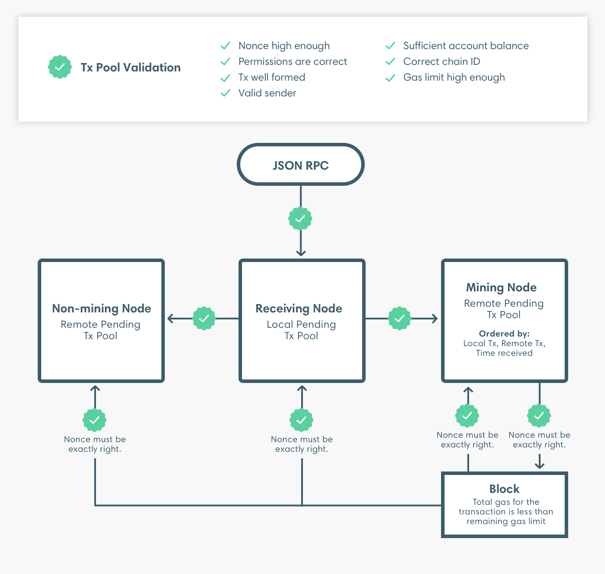

# Transaction validation

For transactions submitted and added to a block, Besu validates the transactions, as illustrated in the following diagram.

Besu repeats the set of transaction pool validations after propagating the transaction. Besu repeats the same set of validations when importing the block that includes the transaction, except the nonce must be exactly right when importing the block.

:::tip

Private transactions are not added to the transaction pool. The privacy marker transaction is submitted to the transaction pool but the private transaction itself is directly distributed to the transaction participants.

:::

When adding the transaction to a block, Besu performs an additional validation to check that the transaction gas limit is less than the remaining block gas limit. After creating a block, the node imports the block and then repeats the transaction pool validations.

:::info

The transaction is only added if the entire transaction gas limit is less than the remaining gas for the block. The total gas used by the transaction is not relevant to this validation. That is, if the total gas used by the transaction is less than the remaining block gas, but the transaction gas limit is more than the remaining block gas, the transaction is not added.

:::
