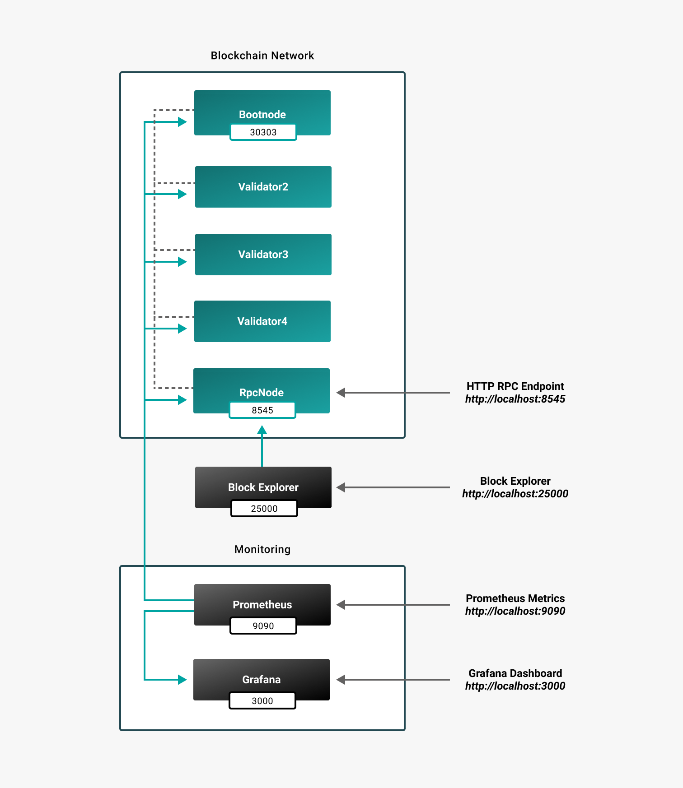
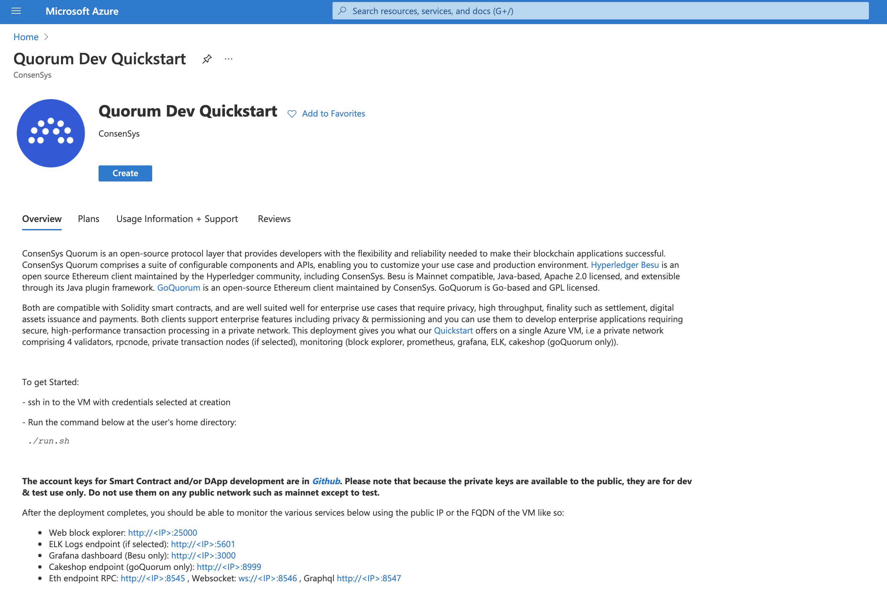
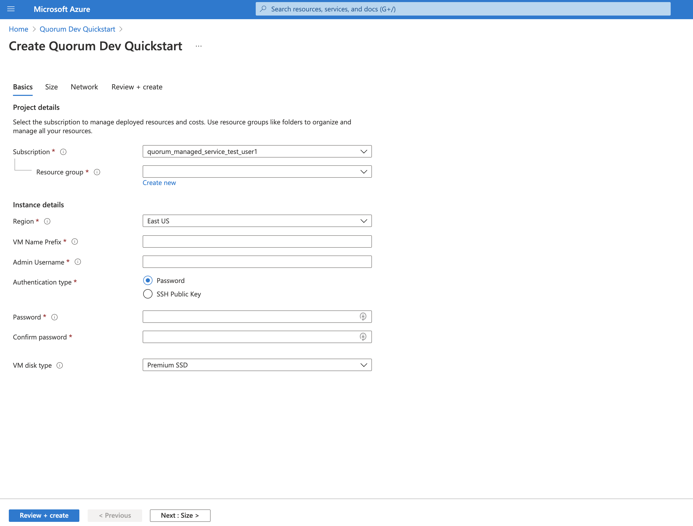
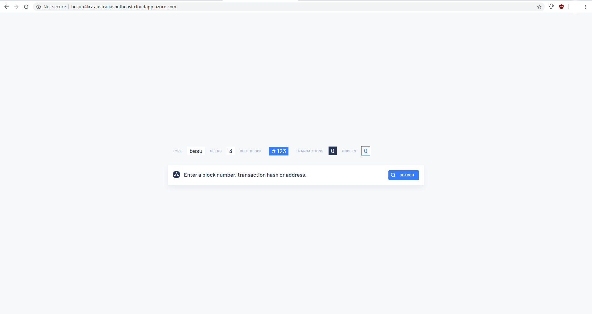
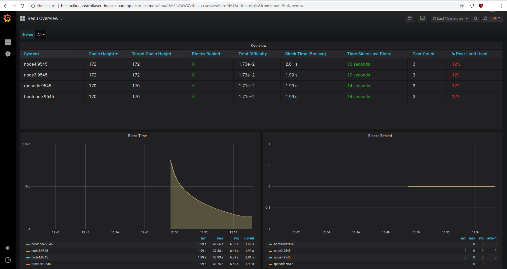

# Deploy private network example on Azure

The [Quorum Dev Quickstart on Azure Marketplace] enables deploying a private IBFT 2.0 network, which includes:

- A bootnode.
- An RPC node.
- Three regular nodes.
- A block explorer.
- Prometheus and Grafana with the Besu dashboard installed.

These are deployed on a single Azure VM in minutes.

Once deployed, you can develop and test applications and connect to the Visual Studio Code (VSCode) plugin using the RPC endpoint `http://<VM_IP>/jsonrpc`.

## Overview

The following is a high-level overview of the deployed network.



## Deploy

To deploy the private network example on Azure:

1. Create a Resource Group in the [Azure Portal](https://portal.azure.com).

1. Go to the [Quorum Dev Quickstart on Azure Marketplace].

1. Click **Get It Now** and **Continue**. The Quickstart landing page is displayed.

   

1. Click **Create**. The **Basics** page is displayed.

   

1. Enter:

   - Details of the Resource Group you created earlier.
   - Basic user credentials to start a VM.
   - Prefix for your new VM and any other resources created.
   - Region to which you wish to deploy the VM.

1. Click **Next: Size** and select the size of the VM you want to use.

1. To start the deployment, click **Review + create** at the bottom left of the page.

   The deployment typically takes 3--5 minutes. The progress of your deployment is displayed.

   When the deployment is complete, the resources created are displayed.

1. Click **Go to Resource**. Everything created in the deployment is displayed.

1. Click on the VM name. The VM details such as the IP and DNS name are displayed. Use the IP and DNS name displayed to connect to the VM, either in browser or via RPC calls.

## Block explorer

To display the block explorer, open a new tab and enter either the IP of the VM or the DNS name.



## Metrics

The deployment includes Prometheus metrics and Grafana with a custom Besu Dashboard installed. To display the dashboard:

1. Open a new tab and enter the IP or DNS name appended with `/grafana`. For example: `http://<DNS_NAME_OF_VM>/grafana`.

1. Click on home and select the Besu dashboard.

   

The dashboard provides a visual way to monitor your network and nodes as the chain progresses. Alerting can also be configured.

## Connect to VM RPC endpoint

You can connect dapps or develop directly from the IDE by using VSCode and connecting to the VM RPC endpoint. The endpoint is the DNS name appended with `/jsonrpc`: `http://<DNS_NAME_OF_VM>/jsonrpc`.

## SSH

You can SSH into the VM to see how everything is set up and working. Use the credentials from step 5 of [deployment](#deploy) and your preferred client:

```bash
ssh username@<DNS_NAME_OF_VM>
```

To list all containers running, run `docker ps`. Find the complete setup in `/home/<username>/besu-quickstart`.


[Quorum Dev Quickstart on Azure Marketplace]: https://azuremarketplace.microsoft.com/en-us/marketplace/apps/consensys.quorum-dev-quickstart
