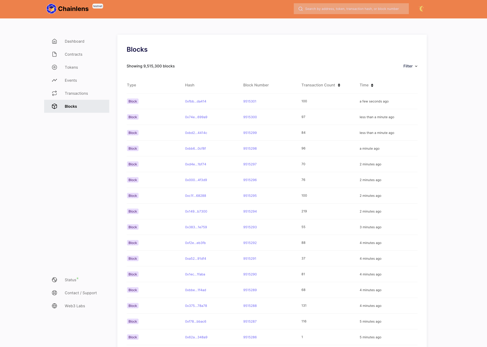
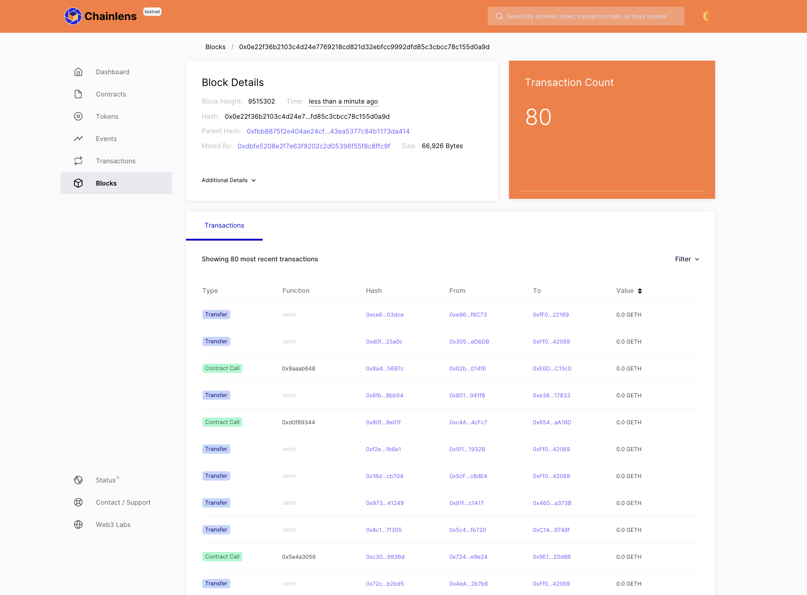
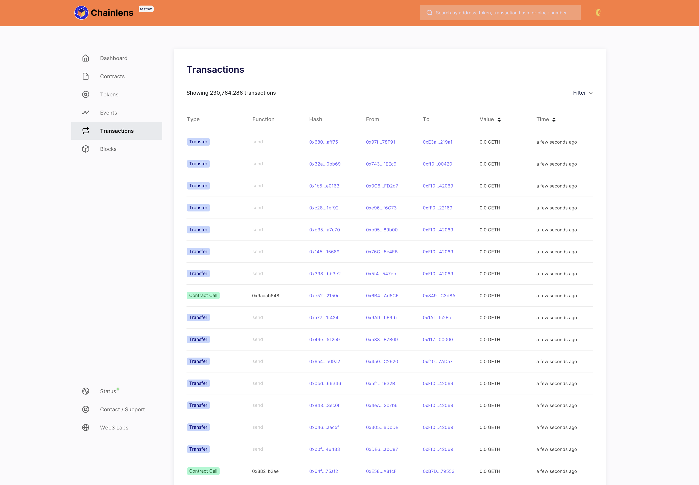
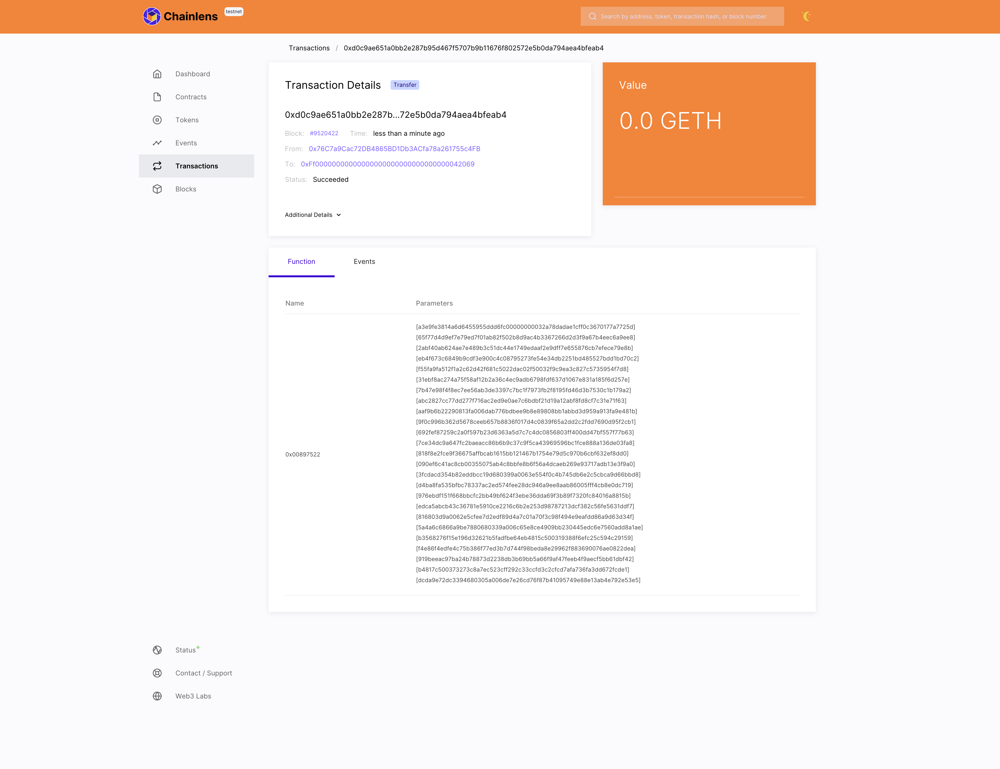
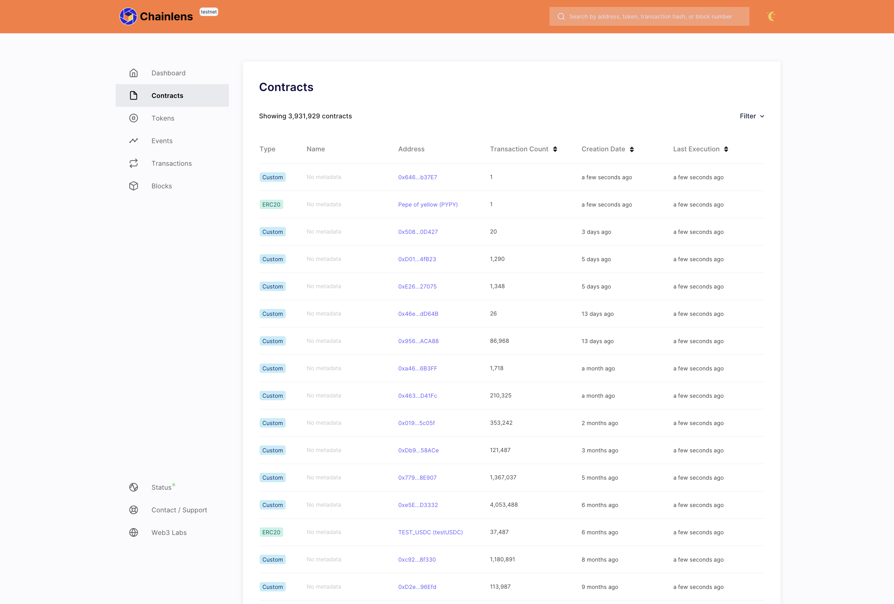
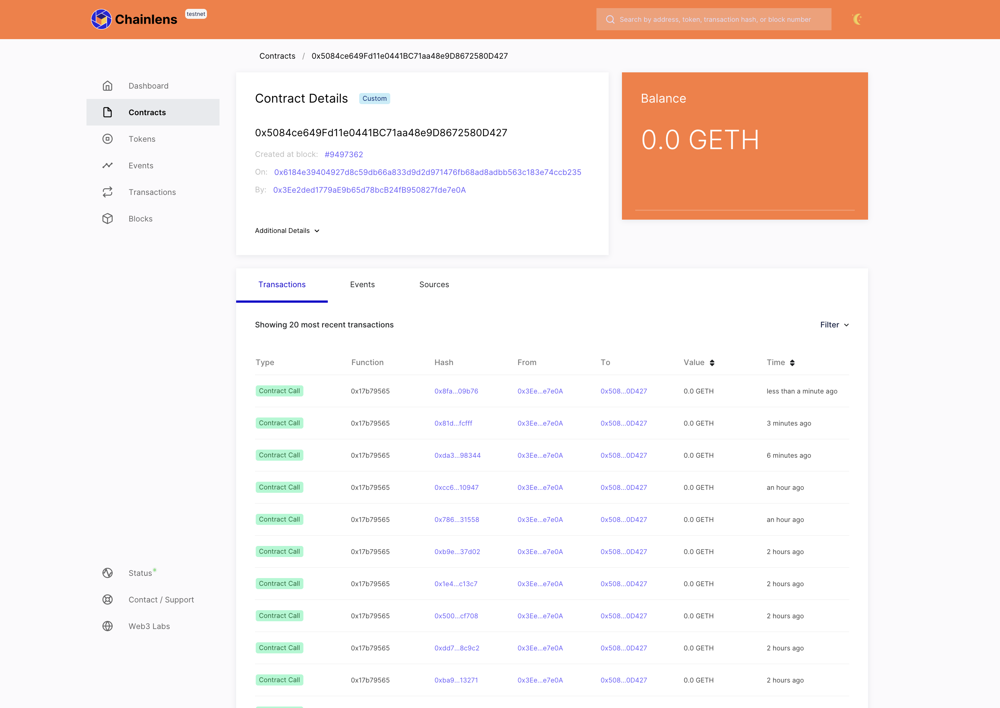
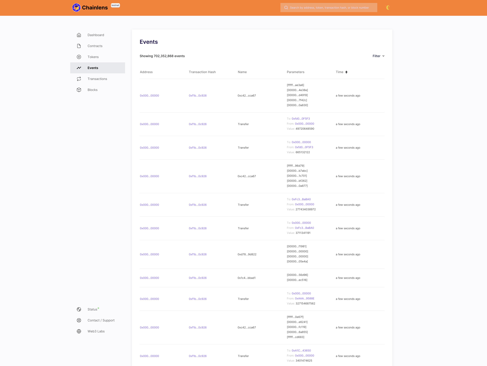

# Use Chainlens Blockchain Explorer

[Chainlens Blockchain Explorer](https://chainlens.com/) supports public and private EVM networks.
This page describes how to use the free version of Chainlens with its built-in support for
[privacy-enabled](../../concepts/privacy/index.md) Besu networks created using the
[Developer Quickstart](../../tutorials/quickstart.md).

Chainlens provides an overview of the entire network, including block information, contract
metadata, transaction searches, and [more](https://chainlens.com/).

:::note
You must connect to one of the privacy nodes (for example, `member1besu`), not the dedicated RPC, to
allow access for Besu [privacy API methods](../../reference/api/index.md#priv-methods).
In production networks, you must [secure access](../../../public-networks/how-to/use-besu-api/authenticate.md)
to RPC nodes.
:::

## Prerequisites

[Docker and Docker Compose](https://docs.docker.com/compose/install/) installed.

## Start Chainlens

Clone the [Chainlens GitHub repository](https://github.com/web3labs/chainlens-free):

```bash
git clone https://github.com/web3labs/chainlens-free
```

The repository contains a `docker-compose` directory to allow Chainlens to start with a Developer
Quickstart test network.
From the `docker-compose` directory, run the following command:

```bash
NODE_ENDPOINT=http://rpcnode:8545 docker-compose -f docker-compose.yml -f chainlens-extensions/docker-compose-quorum-dev-quickstart.yml up
```

This command does two things:

- Sets up the node endpoint
- Tells Docker to run by using the two Docker Compose files provided

The first `docker-compose.yml` file in the command contains all the services required for Chainlens.

The second file named `docker-compose-quorum-dev-quickstart` contains the network settings required to start
Chainlens on the same network as the Besu development node.

Next, open `http://localhost/` on your browser.
You’ll see the new initialization page while it boots up.
This may take 5–10 minutes for the all services to start and the ingestion sync to complete.


## View on Chainlens

After starting Chainlens, you can view information about your network.

:::note
Screenshots in this section are taken from the [Chainlens Holesky network](https://holesky.chainlens.com/dashboard).
:::

The **Dashboard** page provides an aggregated view of network activities.


The **Network** page provides an overview of the network status and connected peers.
This page is disabled by default, and is only visible if you set `DISPLAY_NETWOR_TAB=enabled` using
the following command:

```bash
NODE_ENDPOINT=http://member1besu:8545 DISPLAY_NETWORK_TAB=enabled docker-compose -f docker-compose.yml -f chainlens-extensions/docker-compose-quorum-dev-quickstart.yml up
```

The **Blocks** page shows a real-time view of the finalized blocks.



You can view a given block details by selecting a block hash or number.



The **Transactions** page shows a paginated view of new and historical transactions.



If you select any transaction hash, you can get the **transaction details.**



The **Contracts** page shows all the smart contracts deployed on the network.



You can view a smart contract details by selecting the contract address.



The **Events** page shows all the events generated on the network.



## Stop Chainlens

To stop all the services from running, run the following command:

```bash
docker-compose down
```
