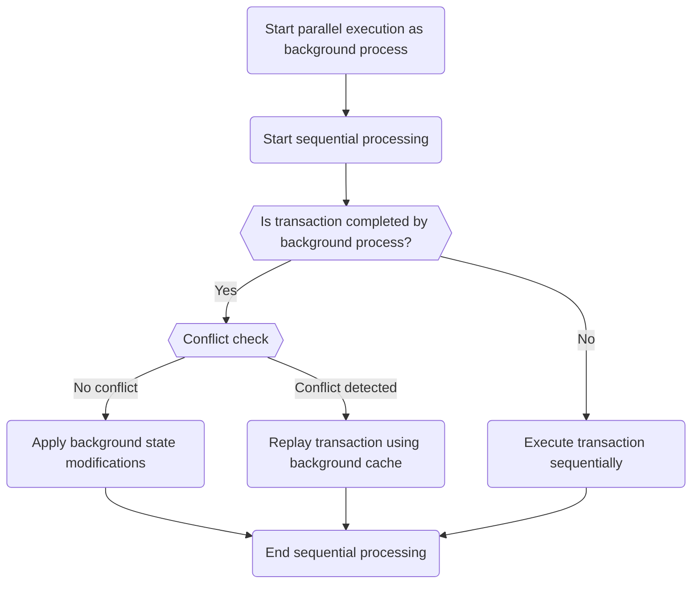
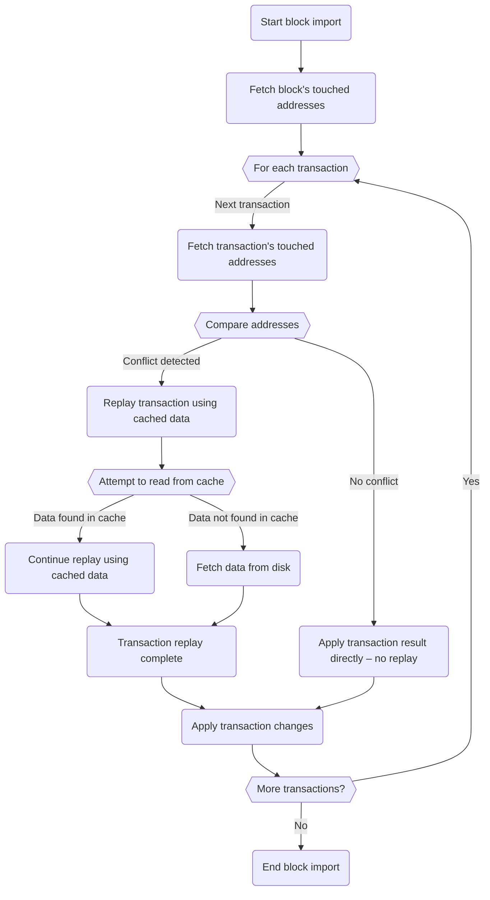
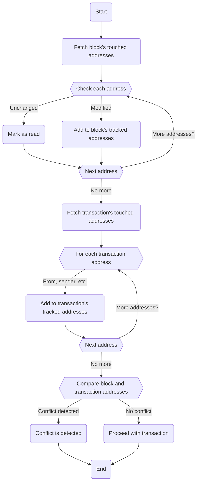

# Parallel transaction execution

Besu supports parallel transaction execution, using an optimistic approach to parallelize
transactions within a block.
You can enable this feature when using the [Bonsai Tries](data-storage-formats.md#bonsai-tries) data
storage format.
This page provides an [overview of the parallelization mechanism](#parallelization-mechanism-overview),
and [metrics](#metrics) that highlight Besu's improved performance.

:::warning Important
Parallel transaction execution is an early access feature.
You can enable it using the `--Xbonsai-parallel-tx-processing-enabled` option.
:::

## Parallelization mechanism overview

When parallel transaction execution is enabled, Besu initially executes all transactions within a
block in parallel, operating under the optimistic assumption that they can all be executed
concurrently without conflict.
This parallel execution runs in the background, and Besu proceeds to sequentially process the
transactions without waiting for the parallel execution to complete.

The following flowchart outlines the transaction execution flow:

Besu first determines if a transaction has been completed by the background parallel execution:

- **Completed:** If the transaction is completed, Besu examines whether there are any conflicts with
  previously executed transactions.
  - **No conflict:** If no conflict is detected, Besu directly applies the state modifications
    generated in the background to the block, avoiding re-execution.
  - **Conflict detected:** If a conflict is detected, Besu replays the transaction, using a cache of
    background reads to improve efficiency.
- **Not completed:** If the transaction is not completed, Besu executes it sequentially within the
  block to ensure its completion, independent of the background execution.

### Conflict detection strategy

Besu's conflict detection strategy uses the *accumulator*, a
[Bonsai Tries](data-storage-formats.md#bonsai-tries) feature that tracks addresses and slots touched
or modified during block or transaction execution.

:::tip
You can read more about Bonsai Tries in [Consensys' Guide to Bonsai Tries](https://consensys.io/blog/bonsai-tries-guide).
:::

If a slot, code, or anything else related to an account is modified, the Bonsai accumulator keeps
track of this information.
This strategy leverages Bonsai's storage benefits, only keeping track of block-to-block state diffs
in Besu storage.

The following flowchart outlines how Besu detects conflicts and imports transactions into the block:

Besu takes what the accumulator tracks at the block and transaction level, compares the
transaction's list of touched addresses to the block's list, and checks for conflicts.
In particular:

1. Besu identifies conflicts by checking whether a transaction has interacted with accounts modified
   by the block (that is, modified by previous transactions).
2. If a conflict is detected, Besu replays the transaction using cached data or data fetched from disk.
3. Each time a transaction is added to the block, Besu incorporates the transaction's tracked list
   into the block's list.

:::info Note
The following are excluded from the conflict check:

- Unchanged accounts read by the block.
- Rewards given to the validator coinbase address at the end of each transaction.
  If these were considered, every transaction would conflict with the coinbase address.
  Besu identifies this address as a conflict only if it is accessed for reasons other than receiving
  rewards at the transaction's conclusion.
:::

The following flowchart outlines how Besu maintains the lists of tracked addresses:

Besu's conflict detection strategy is intentionally simple to minimize edge cases.
With this approach to parallel transaction execution,
[approximately 40% of transactions do not require replay](#metrics).
In the future, the conflict detection strategy may be refined to reduce false positives.

You can enable parallel transaction execution using the `--Xbonsai-parallel-tx-processing-enabled` option.

## Metrics

Parallel transaction execution uses Besu's resources more efficiently than traditional
sequential execution, significantly improving performance.

The following metrics were collected on nodes running on Azure VMs (Standard D8as v5 – 8 vCPUs, 32
GiB memory), with Teku and Nimbus as consensus layer (CL) clients:

- **Block processing time** - With Teku as CL client, block processing time improves by at least 25%.
  The 50th percentile decreases from 282 ms to 207 ms and the 95th
  percentile decreases from 479 ms to 393 ms.

  With Nimbus as CL client, block processing improves by approximately 45%, with the 50th percentile
  at 155 ms, and the 95th percentile at 299 ms.
  Besu running with Nimbus has better performance than with Teku because Nimbus has less overhead on
  Besu, meaning less context switching and fewer cache misses.

- **Execution throughput** - Execution throughput increases, with an average of 96 Mgas/s and peaks
  of up to 250 Mgas/s.

- **Parallel transactions** - Parallel transaction execution introduces two new metrics, which
  indicate that approximately 40% of transactions are parallelized using this feature:

  - `besu_block_processing_parallelized_transactions_counter_total` - The number of transactions
    executed in parallel.
  - `besu_block_processing_conflicted_transactions_counter_total` - The number of transactions that
    encountered conflicts and were therefore executed sequentially.

- **Sync time** - Snap synchronization time is approximately 27 hours and 5 minutes, with block import
  time approximately 6 ms on average.

- **CPU profiling** - The new payload call time decreases from 251.68 ms to 172.04 ms on average,
  with notable improvements in SLOAD operation times.

During the faster block processing time, Besu uses more CPU and more disk accesses in parallel
(higher IOPS).
However, when these metrics are averaged on different monitoring tools, the resource usage looks the same as
with sequential execution.
Overall, parallel transaction execution improves Besu performance with almost no resource usage
overhead.
