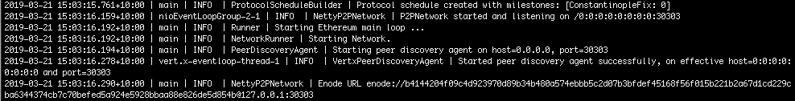

import Tabs from '@theme/Tabs';
import TabItem from '@theme/TabItem';

# Create a private network using QBFT

A private network provides a configurable network for testing. This private network uses the [QBFT (proof of authority) consensus protocol](../how-to/configure/consensus/qbft.md).

The QBFT network in this tutorial implements the [block header validator selection method] to manage validators. For a tutorial on how to implement the [contract validator selection method], follow the steps in the [example smart contract repository].

:::important

The steps in this tutorial create an isolated, but not protected or secure, Ethereum private network. We recommend running the private network behind a properly configured firewall.

This tutorial configures a private network using QBFT for educational purposes only. QBFT requires 4 validators to be Byzantine fault tolerant.

:::

## Prerequisites

- [Hyperledger Besu](../get-started/install/binary-distribution.md)
- [Curl (or similar webservice client)](https://curl.haxx.se/download.html).

## Steps

Listed on the right-hand side of the page are the steps to create a private network using QBFT with four nodes. The four nodes are all validators.

### 1. Create directories

Each node requires a data directory for the blockchain data.

Create directories for your private network, each of the four nodes, and a data directory for each node:

```bash
QBFT-Network/
├── Node-1
│   ├── data
├── Node-2
│   ├── data
├── Node-3
│   ├── data
└── Node-4
    ├── data
```

### 2. Create a configuration file

The configuration file defines the [QBFT genesis file](../how-to/configure/consensus/qbft.md#genesis-file) and the number of node key pairs to generate.

The configuration file has two nested JSON nodes. The first is the `genesis` property defining the QBFT genesis file, except for the `extraData` string, which Besu generates automatically in the resulting genesis file. The second is the `blockchain` property defining the number of key pairs to generate.

Copy the following configuration file definition to a file called `qbftConfigFile.json` and save it in the `QBFT-Network` directory:

```json
{
  "genesis": {
    "config": {
      "chainId": 1337,
      "berlinBlock": 0,
      "qbft": {
        "blockperiodseconds": 2,
        "epochlength": 30000,
        "requesttimeoutseconds": 4
      }
    },
    "nonce": "0x0",
    "timestamp": "0x58ee40ba",
    "gasLimit": "0x47b760",
    "difficulty": "0x1",
    "mixHash": "0x63746963616c2062797a616e74696e65206661756c7420746f6c6572616e6365",
    "coinbase": "0x0000000000000000000000000000000000000000",
    "alloc": {
      "fe3b557e8fb62b89f4916b721be55ceb828dbd73": {
        "privateKey": "8f2a55949038a9610f50fb23b5883af3b4ecb3c3bb792cbcefbd1542c692be63",
        "comment": "private key and this comment are ignored.  In a real chain, the private key should NOT be stored",
        "balance": "0xad78ebc5ac6200000"
      },
      "627306090abaB3A6e1400e9345bC60c78a8BEf57": {
        "privateKey": "c87509a1c067bbde78beb793e6fa76530b6382a4c0241e5e4a9ec0a0f44dc0d3",
        "comment": "private key and this comment are ignored.  In a real chain, the private key should NOT be stored",
        "balance": "90000000000000000000000"
      },
      "f17f52151EbEF6C7334FAD080c5704D77216b732": {
        "privateKey": "ae6ae8e5ccbfb04590405997ee2d52d2b330726137b875053c36d94e974d162f",
        "comment": "private key and this comment are ignored.  In a real chain, the private key should NOT be stored",
        "balance": "90000000000000000000000"
      }
    }
  },
  "blockchain": {
    "nodes": {
      "generate": true,
      "count": 4
    }
  }
}
```

:::note

We recommend specifying the latest [milestone](../../public-networks/reference/genesis-items.md#milestone-blocks) when creating the genesis file for a private network. This ensures you are using the most up-to-date protocol and have access to the most recent opcodes.

:::

:::warning

Do not use the accounts in `alloc` in the genesis file on Mainnet or any public network except for testing. The private keys display, which means the accounts are not secure.

:::

### 3. Generate node keys and a genesis file

In the `QBFT-Network` directory, generate the node key and genesis file:

```bash
besu operator generate-blockchain-config --config-file=qbftConfigFile.json --to=networkFiles --private-key-file-name=key
```

Besu creates the following in the `networkFiles` directory:

- `genesis.json` - The genesis file including the `extraData` property specifying the four nodes are validators.
- A directory for each node named using the node address and containing the public and private key for each node.

```text
networkFiles/
├── genesis.json
└── keys
    ├── 0x438821c42b812fecdcea7fe8235806a412712fc0
    │   ├── key
    │   └── key.pub
    ├── 0xca9c2dfa62f4589827c0dd7dcf48259aa29f22f5
    │   ├── key
    │   └── key.pub
    ├── 0xcd5629bd37155608a0c9b28c4fd19310d53b3184
    │   ├── key
    │   └── key.pub
    └── 0xe96825c5ab8d145b9eeca1aba7ea3695e034911a
        ├── key
        └── key.pub
```

### 4. Copy the genesis file to the QBFT-Network directory

Copy the `genesis.json` file to the `QBFT-Network` directory.

### 5. Copy the node private keys to the node directories

For each node, copy the key files to the `data` directory for that node

```text
QBFT-Network/
├── genesis.json
├── Node-1
│   ├── data
│   │    ├── key
│   │    ├── key.pub
├── Node-2
│   ├── data
│   │    ├── key
│   │    ├── key.pub
├── Node-3
│   ├── data
│   │    ├── key
│   │    ├── key.pub
├── Node-4
│   ├── data
│   │    ├── key
│   │    ├── key.pub
```

### 6. Start the first node as the bootnode

In the `Node-1` directory, start Node-1:

<Tabs>

<TabItem value="MacOS" label="MacOS" default>

```bash
besu --data-path=data --genesis-file=../genesis.json --rpc-http-enabled --rpc-http-api=ETH,NET,QBFT --host-allowlist="*" --rpc-http-cors-origins="all"
```

</TabItem>

<TabItem value="Windows" label="Windows">

```bash
besu --data-path=data --genesis-file=..\genesis.json --rpc-http-enabled --rpc-http-api=ETH,NET,QBFT --host-allowlist="*" --rpc-http-cors-origins="all"
```

</TabItem>

</Tabs>

The command line:

- Specifies the data directory for Node-1 using the [`--data-path`](../../public-networks/reference/cli/options.md#data-path) option.
- Enables the JSON-RPC API using the [`--rpc-http-enabled`](../../public-networks/reference/cli/options.md#rpc-http-enabled) option.
- Enables the ETH, NET, and QBFT APIs using the [`--rpc-http-api`](../../public-networks/reference/cli/options.md#rpc-http-api) option.
- Enables all-host access to the HTTP JSON-RPC API using the [`--host-allowlist`](../../public-networks/reference/cli/options.md#host-allowlist) option.
- Enables all-domain access to the node through the HTTP JSON-RPC API using the [`--rpc-http-cors-origins`](../../public-networks/reference/cli/options.md#rpc-http-cors-origins) option.

When the node starts, the [enode URL](../../public-networks/concepts/node-keys.md#enode-url) displays. Copy the enode URL to specify Node-1 as the bootnode in the following steps.



### 7. Start Node-2

Start another terminal, change to the `Node-2` directory and start Node-2 specifying the Node-1 enode URL copied when starting Node-1 as the bootnode:

<Tabs>

<TabItem value="MacOS" label="MacOS" default>

```bash
besu --data-path=data --genesis-file=../genesis.json --bootnodes=<Node-1 Enode URL> --p2p-port=30304 --rpc-http-enabled --rpc-http-api=ETH,NET,QBFT --host-allowlist="*" --rpc-http-cors-origins="all" --rpc-http-port=8546
```

</TabItem>

<TabItem value="Windows" label="Windows">

```bash
besu --data-path=data --genesis-file=..\genesis.json --bootnodes=<Node-1 Enode URL> --p2p-port=30304 --rpc-http-enabled --rpc-http-api=ETH,NET,QBFT --host-allowlist="*" --rpc-http-cors-origins="all" --rpc-http-port=8546
```

</TabItem>

</Tabs>

The command line specifies:

- The data directory for Node-2 using the [`--data-path`](../../public-networks/reference/cli/options.md#data-path) option.
- A different port to Node-1 for P2P discovery using the [`--p2p-port`](../../public-networks/reference/cli/options.md#p2p-port) option.
- A different port to Node-1 for HTTP JSON-RPC using the [`--rpc-http-port`](../../public-networks/reference/cli/options.md#rpc-http-port) option.
- The enode URL of Node-1 using the [`--bootnodes`](../../public-networks/reference/cli/options.md#bootnodes) option.
- Other options as for [Node-1](#6-start-the-first-node-as-the-bootnode).

### 8. Start Node-3

Start another terminal, change to the `Node-3` directory and start Node-3 specifying the Node-1 enode URL copied when starting Node-1 as the bootnode:

<Tabs>

<TabItem value="MacOS" label="MacOS" default>

```bash
besu --data-path=data --genesis-file=../genesis.json --bootnodes=<Node-1 Enode URL> --p2p-port=30305 --rpc-http-enabled --rpc-http-api=ETH,NET,QBFT --host-allowlist="*" --rpc-http-cors-origins="all" --rpc-http-port=8547
```

</TabItem>

<TabItem value="Windows" label="Windows">


```bash
besu --data-path=data --genesis-file=..\genesis.json --bootnodes=<Node-1 Enode URL> --p2p-port=30305 --rpc-http-enabled --rpc-http-api=ETH,NET,QBFT --host-allowlist="*" --rpc-http-cors-origins="all" --rpc-http-port=8547
```

</TabItem>

</Tabs>

The command line specifies:

- The data directory for Node-3 using the [`--data-path`](../../public-networks/reference/cli/options.md#data-path) option.
- A different port to Node-1 and Node-2 for P2P discovery using the [`--p2p-port`](../../public-networks/reference/cli/options.md#p2p-port) option.
- A different port to Node-1 and Node-2 for HTTP JSON-RPC using the [`--rpc-http-port`](../../public-networks/reference/cli/options.md#rpc-http-port) option.
- The bootnode as for [Node-2](#7-start-node-2).
- Other options as for [Node-1](#6-start-the-first-node-as-the-bootnode).

### 9. Start Node-4

Start another terminal, change to the `Node-4` directory and start Node-4 specifying the Node-1 enode URL copied when starting Node-1 as the bootnode:

<Tabs>

<TabItem value="MacOS" label="MacOS" default>

```bash
besu --data-path=data --genesis-file=../genesis.json --bootnodes=<Node-1 Enode URL> --p2p-port=30306 --rpc-http-enabled --rpc-http-api=ETH,NET,QBFT --host-allowlist="*" --rpc-http-cors-origins="all" --rpc-http-port=8548
```

</TabItem>

<TabItem value="Windows" label="Windows">

```bash
besu --data-path=data --genesis-file=..\genesis.json --bootnodes=<Node-1 Enode URL> --p2p-port=30306 --rpc-http-enabled --rpc-http-api=ETH,NET,QBFT --host-allowlist="*" --rpc-http-cors-origins="all" --rpc-http-port=8548
```

</TabItem>

</Tabs>

The command line specifies:

- The data directory for Node-4 using the [`--data-path`](../../public-networks/reference/cli/options.md#data-path) option.
- A different port to Node-1, Node-2, and Node-3 for P2P discovery using the [`--p2p-port`](../../public-networks/reference/cli/options.md#p2p-port) option.
- A different port to Node-1, Node-2, and Node-3 for HTTP JSON-RPC using the [`--rpc-http-port`](../../public-networks/reference/cli/options.md#rpc-http-port) option.
- The bootnode as for [Node-2](#7-start-node-2).
- Other options as for [Node-1](#6-start-the-first-node-as-the-bootnode).

### 10. Confirm the private network is working

Start another terminal, use curl to call the JSON-RPC API [`qbft_getvalidatorsbyblocknumber`](../reference/api/index.md#qbft_getvalidatorsbyblocknumber) method and confirm the network has four validators:

```bash
curl -X POST --data '{"jsonrpc":"2.0","method":"qbft_getValidatorsByBlockNumber","params":["latest"], "id":1}' localhost:8545
```

The result displays the four validators:

```json
{
  "jsonrpc": "2.0",
  "id": 1,
  "result": [
    "0x73ced0bd3def2e2d9859e3bd0882683a2e6835fb",
    "0x7a175f3542ceb60bf80fb536b3f42e7a30c0a6d7",
    "0x7f6efa6e34f8c9b591a9ad4763e21b3fca31bcd6",
    "0xc64140f1c9d5bb82e54976e568ad39958c3e94be"
  ]
}
```

Look at the logs to confirm Besu is producing blocks:

```bash
2021-05-26 08:47:00.221+10:00 | EthScheduler-Workers-0 | INFO  | PersistBlockTask | Imported #1 / 0 tx / 0 om / 0 (0.0%) gas / (0x4ee4456536e2793523df87288fae76518089eec91c3f7e05e220f1f4d3f6f95b) in 0.016s. Peers: 4
2021-05-26 08:47:02.071+10:00 | pool-8-thread-1 | INFO  | QbftBesuControllerBuilder | Imported #2 / 0 tx / 0 pending / 0 (0.0%) gas / (0x6fc47ada7146d75f6a46911d8d4038795b0c99970bbd4ce0c6d6aa60955f66fe)
2021-05-26 08:47:04.051+10:00 | pool-8-thread-1 | INFO  | QbftBesuControllerBuilder | Imported #3 / 0 tx / 0 pending / 0 (0.0%) gas / (0x3cb663880a65103266b11a8d8631beca5c482d515ac287125aa077b2e31b80b0)
2021-05-26 08:47:06.058+10:00 | pool-8-thread-1 | INFO  | QbftBesuControllerBuilder | Produced #4 / 0 tx / 0 pending / 0 (0.0%) gas / (0xc2927915ac0c94bab5fc9acea6608455f1c857d69e97191dc2c39e4ac411817b)
2021-05-26 08:47:08.058+10:00 | pool-8-thread-1 | INFO  | QbftBesuControllerBuilder | Imported #5 / 0 tx / 0 pending / 0 (0.0%) gas / (0xba63471d62c936733add9b884f5213c3842af9f52460268e39e0666ab82f02a5)
```

:::important

If the key files were not copied to the correct directory in [step 5](#5-copy-the-node-private-keys-to-the-node-directories), the network will not start producing blocks.

The logs for each node should indicate the public key was loaded from the `data/key` directory:

```bash
2021-05-26 08:43:16.592+10:00 | main | INFO  | KeyPairUtil | Loaded public key 0x931d32f1aec4e45b150ee38f3c74157a750fc53f523e63fe2b07bf3fce43a3de64587fc9aaf3736444f2e3eef0eea90be3b67d18be7b5b2b7cb2fcd670416a7e from <path-to-network>/QBFT-Network/Node-1/data/key
```

If the keys were not copied to the correct directory, Besu creates a key when starting up:

```bash
2021-05-26 08:43:16.592+10:00 | main | INFO  | KeyPairUtil | Generated new public key 0x1a4a2ade5ebc0a85572e2492e0cdf3e96b8928c75fa55b4425de8849850cf9b3a8cad1e27d98a3d3afac326a5e8788dbe6cc40249715c92825aebb28abe3e346 and stored it to <path-to-network>/QBFT-Network/Node-1/data/key
```

If a new key was created, the validator key specified in the configuration does not match the created key and the node cannot participate in creating blocks.

:::

## Next steps

Use the [QBFT API](../reference/api/index.md#qbft-methods) to remove or add validators, or import accounts to MetaMask and send transactions as described in the [Quickstart tutorial](quickstart.md#create-a-transaction-using-metamask).

:::note

To add or remove nodes as validators you need the node address. The directory [created for each node](#3-generate-node-keys-and-a-genesis-file) has the node address as the name.

Besu doesn't support [private key management](../../public-networks/how-to/send-transactions.md).

:::

You can switch from the [block header validator selection method] configured here, to the [contract validator selection method] by updating the genesis file and [configuring a transition].

## Stop the nodes

When finished using the private network, stop all nodes using ++ctrl+c++ in each terminal window.

:::tip

To restart the QBFT network in the future, start from [step 6](#6-start-the-first-node-as-the-bootnode).

:::

<!-- Links -->

[block header validator selection method]: ../how-to/configure/consensus/qbft.md#add-and-remove-validators-using-block-headers
[contract validator selection method]: ../how-to/configure/consensus/qbft.md#add-and-remove-validators-using-a-smart-contract
[example smart contract repository]: https://github.com/ConsenSys/validator-smart-contracts
[configuring a transition]: ../how-to/configure/consensus/qbft.md#transitions

<!-- Acronyms and Definitions -->

\*[Byzantine fault tolerant]: Ability to function correctly and reach consensus despite nodes failing or propagating incorrect information to peers.
