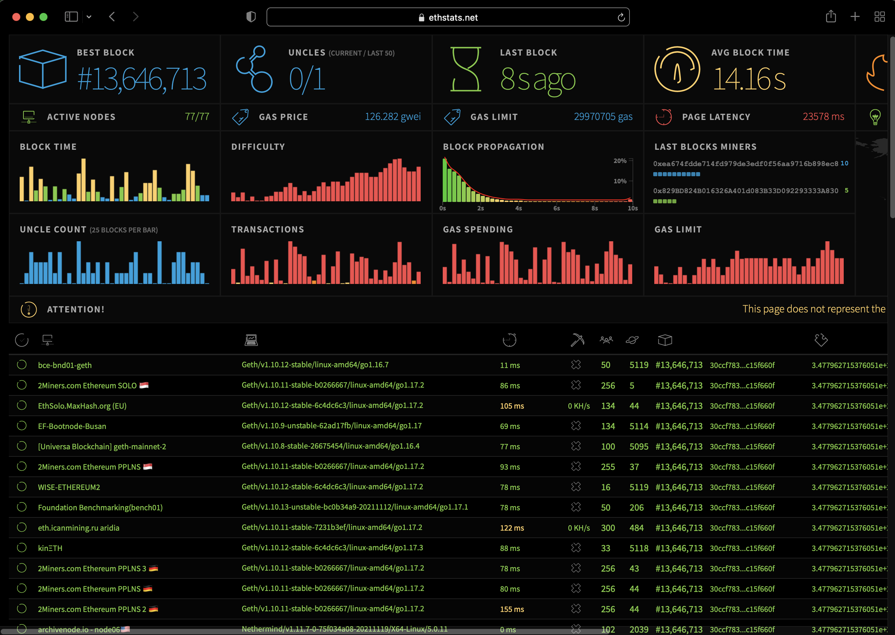

# Connect to Ethstats network monitor

Connect to [Ethstats](https://ethstats.dev) to display real time and historical [statistics](#statistics) about the network and nodes. You can connect to the Ethstats dashboard by [connecting to a client and server](#connect-through-a-client-and-server) or by [connecting through the command line](#connect-through-the-command-line).

## Components

Ethstats consists of:

- A [server](https://github.com/goerli/ethstats-server), which consumes node data received from the client.
- A [client](https://github.com/goerli/ethstats-client), which extracts data from the node and sends it to the server.
- A [dashboard](https://github.com/goerli/ethstats-client#available-dashboards), which displays statistics.

## Statistics

Statistics displayed by Ethstats include:

- Nodes in the network. Metrics for nodes include:
  - Information about the last received block such as block number, block hash, transaction count, uncle count, block time, and propagation time.
  - Connected peers, whether the node is mining, hash rate, latency, and uptime.
- Charts for block time, block difficulty, block gas limit, block uncles, block transactions, block gas used, block propagation histogram, and top miners.
- IP-based geolocation overview.
- Node logs, which display the data sent by a node.
- Block history, which provides the ability to go back in time and playback the block propagation through the nodes.

## Connect through a client and server

Refer to the external [Ethstats client](https://github.com/goerli/ethstats-client) and [Ethstats server](https://github.com/goerli/ethstats-server) documentation for installing those components and connecting to a dashboard.

## Connect through the command line

You can use command line options to connect a node directly to a [dashboard](https://github.com/goerli/ethstats-client#available-dashboards), without using a client.

Start a node using the [`--ethstats`](../../../public-networks/reference/cli/options.md#ethstats) option to specify the Ethstats server URL. You can specify a contact email to send to the server using [`--ethstats-contact`](../../../public-networks/reference/cli/options.md#ethstats-contact).

```bash
besu --ethstats=Dev-Node-1:secret@127.0.0.1:3001 --ethstats-contact=contact@mail.com
```

:::note

A server must be specified by `--ethstats` in order to use `--ethstats-contact`.

:::

Open the selected dashboard website. Find your node under the list of nodes to see the statistics for the node and the network.


