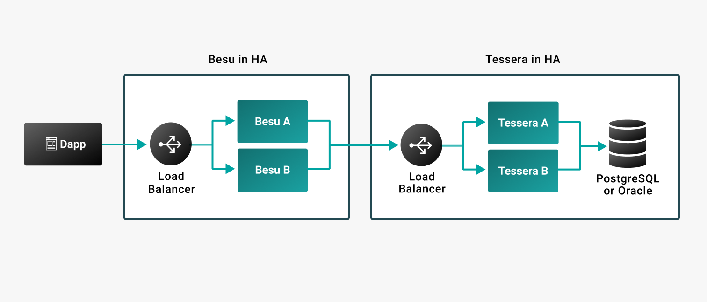

# Run Tessera with Besu

To enable [privacy functionality](../../concepts/privacy/index.md) in production systems, [Tessera](https://docs.tessera.consensys.net/) must be [highly available](#high-availability) and [run in a separate instance](#separate-instances) to Hyperledger Besu.

:::note

You can also configure Besu for high availability using load balancers.

:::

## High availability

Privacy requires you to [configure Tessera for high availability]. Besu also requires [`orion` mode](https://docs.tessera.consensys.net/HowTo/Configure/Orion-Mode) to be enabled in Tessera.

To successfully distribute a private transaction, all private transaction participants must be online. If any participants are offline when submitting the private transaction, the transaction is not attempted and you need to resubmit the transaction.

If a Tessera node is unavailable when Besu attempts to process a privacy marker transaction, the Besu node stops processing all new blocks until Tessera is available. The Besu node continually attempts to process the privacy marker transaction until Tessera is available again.

:::caution

If Tessera becomes available but has lost data, Besu resumes processing blocks and the private states in the Besu nodes might become inconsistent.

:::

## Separate instances

For production systems, we recommend running Besu and Tessera in separate instances. If running Besu and Tessera in the same instance, restrict the amount of memory used by each JVM to ensure each has enough memory.

<!-- links -->

[configure Tessera for high availability]: https://consensys.net/docs/goquorum//en/stable/configure-and-manage/configure/high-availability/
