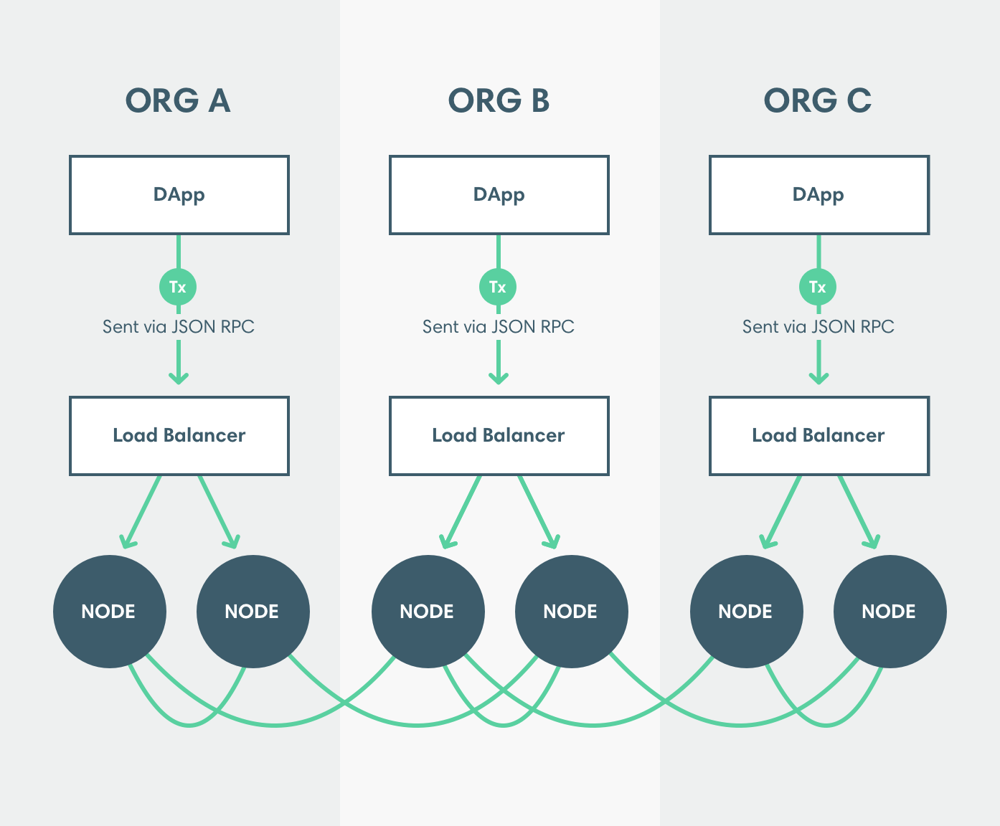

# High availability of JSON-RPC and RPC Pub/Sub APIs

To enable high availability to the [RPC Pub/Sub API over WebSocket](../use-besu-api/rpc-pubsub.md) or the [JSON-RPC API](../use-besu-api/json-rpc.md), run and synchronize more than one Hyperledger Besu node to the network. Use a load balancer to distribute requests across nodes in the cluster that are ready to receive requests.

:::tip

We don't recommend putting [bootnodes](../../../private-networks/how-to/configure/bootnodes.md) behind a load balancer.

:::

:::info

We recommend using load balancers over WebSockets because WebSockets are persistent connections associated with specific nodes. If you use load balancers configured in sticky mode over HTTP instead, the connection sticks to the associated node even when the node is congested and there is a lower load node available. If you use load balancers not configured in sticky mode over HTTP, the connections may switch from node to node, so some JSON-RPC requests may not provide expected results (for example, [`admin` methods](../../reference/api/index.md#admin-methods), [`net_enode`](../../reference/api/index.md#net_enode), [`net_peerCount`](../../reference/api/index.md#net_peercount), and [`eth_syncing`](../../reference/api/index.md#eth_syncing)).

:::

## Determine when a node is ready

Use the [readiness endpoint](../use-besu-api/json-rpc.md#readiness-and-liveness-endpoints) to determine when a node is ready.

:::note

The minimum number of peers and number of blocks from the best known block for determining if a node considered ready is deployment specific.

:::

## Transaction nonces

Besu obtains the nonce for the next transaction using [`eth_getTransactionCount`](../../reference/api/index.md#eth_gettransactioncount). The nonce depends on the transactions in the [transaction pool](../../concepts/transactions/pool.md). If sending [`eth_getTransactionCount`](../../reference/api/index.md#eth_gettransactioncount) and [`eth_sendRawTransaction`](../../reference/api/index.md#eth_sendrawtransaction) requests for a specific account to more than one node, the [`eth_getTransactionCount`](../../reference/api/index.md#eth_gettransactioncount) results might be incorrect.

:::note

If using [private transactions](../../../private-networks/concepts/privacy/private-transactions/index.md), retrieve the nonce using [`priv_getTransactionCount`](../../../private-networks/reference/api/index.md#priv_gettransactioncount) or [`priv_getEeaTransactionCount`](../../../private-networks/reference/api/index.md#priv_geteeatransactioncount) and send the private transactions using [`eea_sendRawTransaction`](../../../private-networks/reference/api/index.md#eea_sendrawtransaction).

:::

To get correct nonces when distributing requests across a cluster, either:

- Track the next nonce outside of the Besu node (as MetaMask does).
- Configure the load balancer in sticky mode to send requests from a specific account to a single node, unless that node is unavailable.

## Subscriptions

You can subscribe to events using:

- [RPC Pub/Sub over WebSockets](../use-besu-api/rpc-pubsub.md).
- [Filters over HTTP](../use-besu-api/access-logs.md).

We recommend using [RPC Pub/Sub over WebSocket](../use-besu-api/rpc-pubsub.md) because WebSockets connections associate with a specific node and do not require using the load balancer in sticky mode.

If using [filters over HTTP](../use-besu-api/access-logs.md), configure the load balancer in sticky mode to associate the subscription with a specific node.

## Recover from dropped subscriptions

Dropped subscriptions can occur because of:

- A disconnected WebSockets connection
- The removal of the node serving the subscription from the ready pool.

If there is a dropped subscription, missed events might occur while reconnecting to a different node. To recover dropped messages, create another subscription and follow the process for that [subscription type](../use-besu-api/rpc-pubsub.md#subscribe):

- [`newHeads`](#new-headers)
- [`logs`](#logs)
- [`newPendingTransactions`](#new-pending-transactions)
- [`droppedPendingTransactions`](#dropped-pending-transactions)
- [`syncing`](#syncing).

### New headers

To request information on blocks from the last block before the subscription dropped to the first block received from the new subscription, use [`eth_getBlockByNumber`](../../reference/api/index.md#eth_getblockbynumber).

### Logs

To request logs from the block number of the last log received before the subscription dropped to the current chain head, use [`eth_getLogs`](../../reference/api/index.md#eth_getlogs).

### New pending transactions

To request all pending transactions for the new node, use [`txpool_besuTransactions`](../../reference/api/index.md#txpool_besutransactions).

:::note

Nodes do not all store the same pending transactions.

:::

### Dropped pending transactions

To request all pending transactions for the new node, use [`txpool_besuTransactions`](../../reference/api/index.md#txpool_besutransactions).

:::note

Nodes do not all store the same pending transactions.

:::

### Syncing

The syncing state of each node is specific to that node. To retrieve the syncing state of the new node, use [`eth_syncing`](../../reference/api/index.md#eth_syncing).
